# 🛒 Deepa Mart

Deepa Mart is a Java-based e-commerce web application developed using Java Servlets, JSP, JDBC, and MySQL. The application allows buyers to browse products, add products to a cart, place orders, and view order history. Sellers can manage their products through a seller dashboard.

## 📌 Problem Statement

Traditional shopping systems can be time-consuming and difficult to manage manually. Customers need a simple platform to browse products, add items to their cart, and place orders.

Deepa Mart provides an online shopping platform that connects buyers and sellers through a web-based application. It helps buyers manage their shopping activities and allows sellers to manage product information.

## 🎯 Objectives

- Provide user registration and login functionality.
- Allow buyers to browse available products.
- Provide cart management functionality.
- Allow buyers to place orders.
- Display order history for buyers.
- Allow sellers to add, edit, and delete products.
- Store user, product, and order details in a MySQL database.
- Provide a simple and user-friendly shopping interface.

## 🏗️ Architecture Diagram

The application follows a layered architecture consisting of the presentation layer, business logic layer, data access layer, and database.

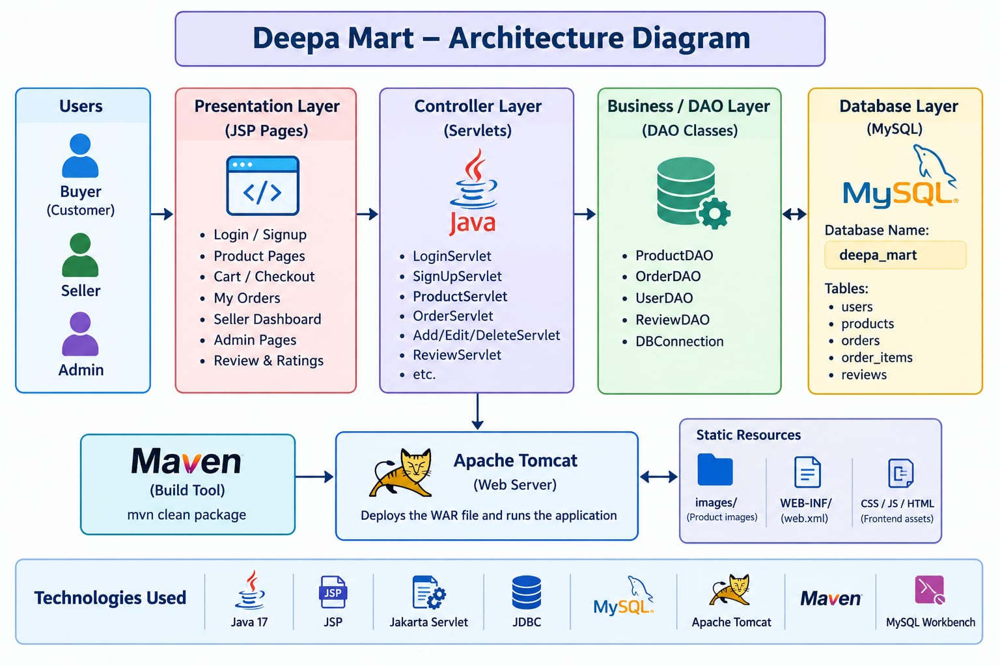

### Architecture Components

1. **Presentation Layer**
   - HTML
   - JSP
   - CSS
   - JavaScript

2. **Controller Layer**
   - Java Servlets
   - Handles user requests and responses.

3. **Business Logic Layer**
   - Processes application operations such as login, product management, cart, and orders.

4. **Data Access Layer**
   - JDBC
   - DAO classes
   - Communicates with the MySQL database.

5. **Database Layer**
   - MySQL
   - Stores users, products, orders, and order items.

## 🛠️ Tech Stack

| Technology | Purpose |
|-----------|---------|
| Java 17 | Application development |
| Java Servlets | Handles requests and responses |
| JSP | Creates dynamic web pages |
| HTML | Structures web pages |
| CSS | Styles the application |
| JavaScript | Provides client-side functionality |
| JDBC | Connects Java application with MySQL |
| MySQL | Database management |
| MySQL Workbench | Database design and management |
| Apache Tomcat 10.1.57 | Application server |
| Maven | Project build and dependency management |
| Git | Version control |
| GitHub | Source code hosting |
| Railway | Application deployment |
| Visual Studio Code | Development environment |

## ✨ Features

### F1: User Registration and Login

- New users can register using the signup page.
- Existing users can log in using their credentials.
- User roles are handled using session management.
- Buyers and sellers are redirected to their respective pages.

### F2: Seller Product Management

Sellers can:

- Add new products.
- View available products.
- Edit product details.
- Delete products.
- Manage product information such as name, category, price, stock, and image.

### F3: Product Browsing

Buyers can:

- View available products.
- See product names and prices.
- View product images.
- Browse products before adding them to the cart.

### F4: Cart Management

Buyers can:

- Add products to the cart.
- View cart items.
- Check product prices and quantities.
- Continue to checkout.

### F5: Checkout and Payment

- Buyers can review their order details.
- Buyers can select a payment method.
- The application supports mock payment options such as COD and UPI.
- Buyers can place an order through the checkout page.

### F6: Order History

- Buyers can view their previous orders.
- Order details include order ID, total amount, payment method, and order status.
- Order status is maintained in the database.

### F7: Admin Management

The project includes an admin dashboard concept for managing application activities and monitoring the system.

### F8: Reviews and Ratings

The project includes a reviews and ratings feature concept to collect customer feedback about products and shopping experiences.

## 🗄️ Database Design

The application uses MySQL as the database.

### Main Database

```text
Database Name: deepa_mart

### Main Tables
   - users
   -products
   -orders
   -order_items

## Entity Relationship Diagram
   The ER diagram represents the relationships between the main entities in the Deepa Mart application
    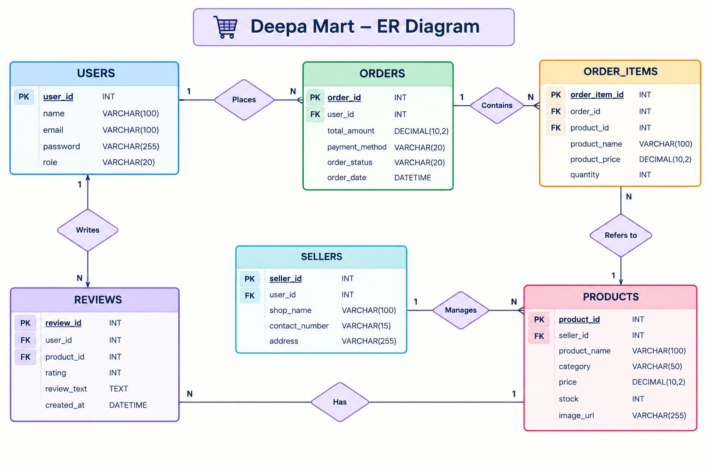

## Project Structure
DeepaMart/
│
├── database/
│
├── docs/
│   ├── architecture-diagram.jpeg
│   ├── er-diagram.jpeg
│   └── screenshots/
│       ├── admin-dashboard.jpeg
│       ├── cart.jpeg
│       ├── checkout.jpeg
│       ├── login.jpeg
│       ├── my-orders.jpeg
│       ├── order-success.jpeg
│       ├── products.jpeg
│       ├── reviews.jpeg
│       ├── seller-dashboard.jpeg
│       └── signup.jpeg
│
├── src/
│   └── main/
│       ├── java/
│       ├── resources/
│       │   └── config.properties
│       └── webapp/
│
├── pom.xml
├── .gitignore
├── Dockerfile
└── README.md

## Setup Instruction
1.Clone the Repository
     git clone https://github.com/DEEPA-NALLATHAMBI/deepamart.git
2.Open the project
   open the cloned project in Visual Studio code or any Java-supported IDE
3.Configure MySQL
  1.Install MySQL Server
  2.Open MySQL Workbench
  3.Create a database named :
        CREATE DATABASE deepa_mart; 
  4. Create the required tables
  5.Update the database configuration in the project
   Example database configuration :
             db.url=jdbc:mysql://localhost:3306/deepa_mart
            db.username=root
            db.password=YOUR_PASSWORD
4. Install Required Software
 Make sure that the following software is installed :
             .Java 17
             .Apache Maven
             .MySQL Server
             .Apache Tomcat 10.1.57
             .Visual Studio Code
5. Build the Project
Open the terminal inside the project folder and run :
             mvn clean package
6. Deploy the Application
      1.Build the project using Maven
      2.Locate the generated WAR file inside the project folder
      3.Deploy the WAR file to Apache Tomcat
      4.Start the Tomcat server
      5.Open the application in a web browser
    Example local URL :
         http://localhost:8080/DeepaMart/

## 🌐 Deployed Application

The Deepa Mart application is deployed using Railway.

🔗 **Live Application:**

https://deepamart-production.up.railway.app

## Screenshots
### 1. Login Page

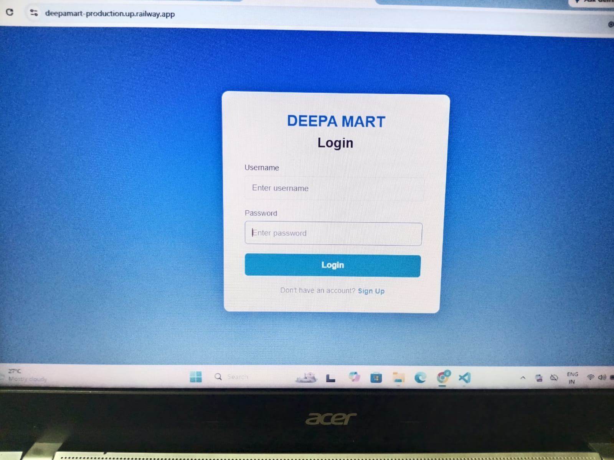

### 2. Signup Page

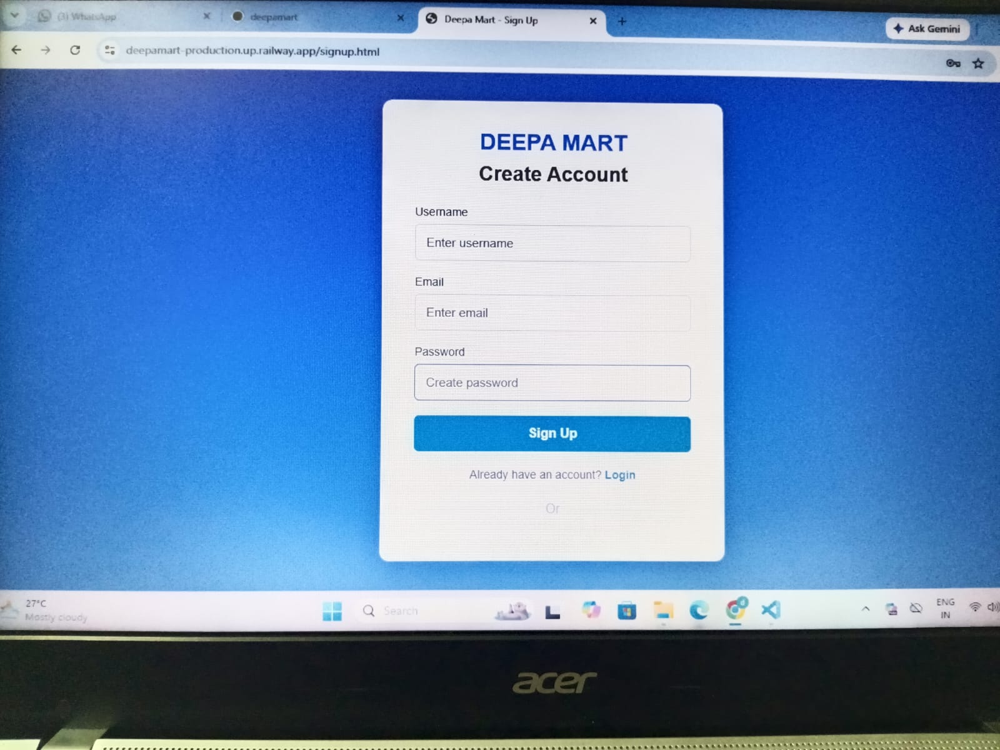

### 3. Products Page

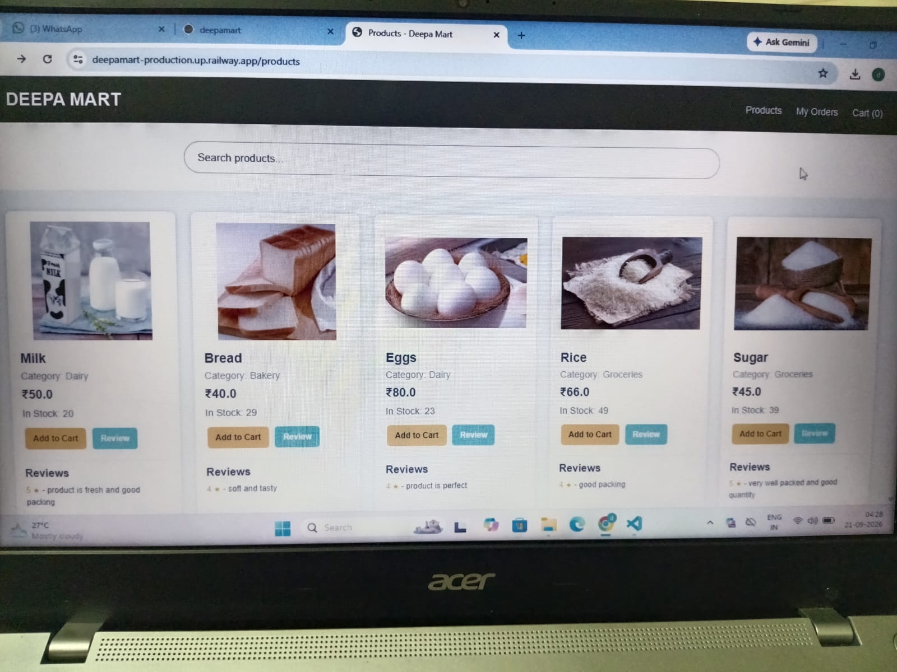

### 4. Cart Page

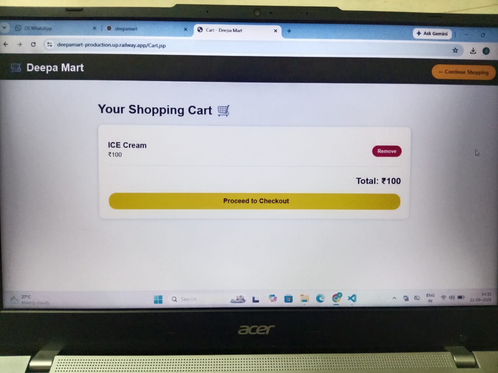

### 5. Checkout Page

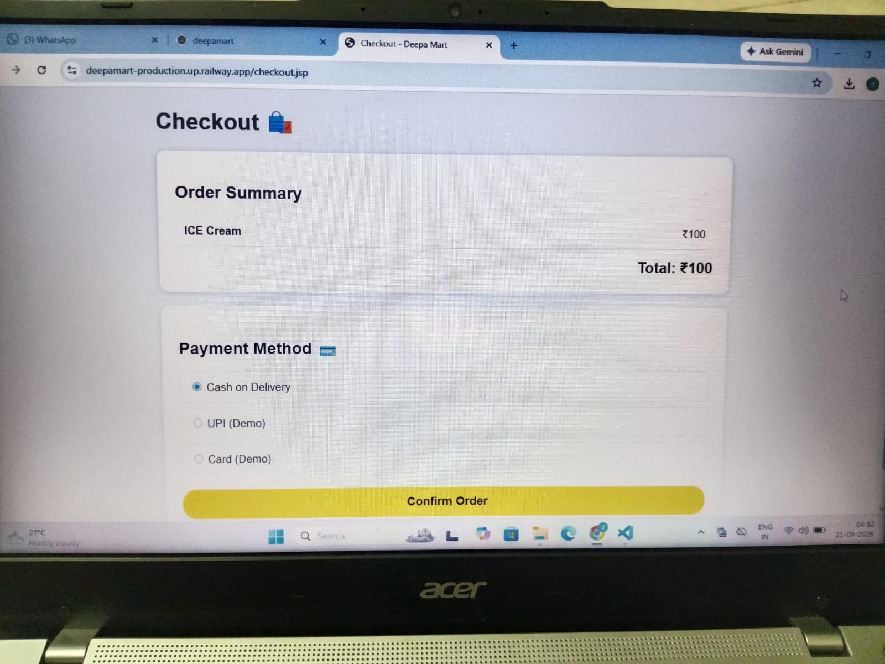

### 6. Order Success Page

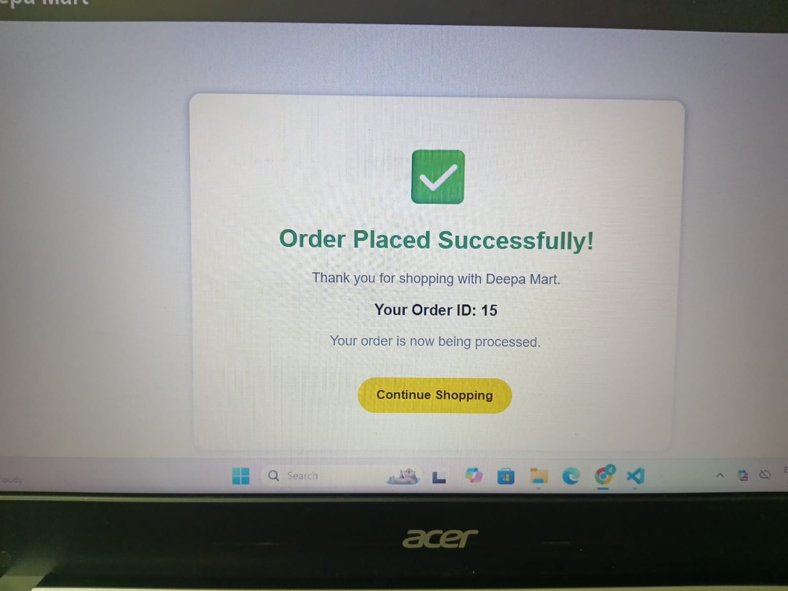

### 7. My Orders Page

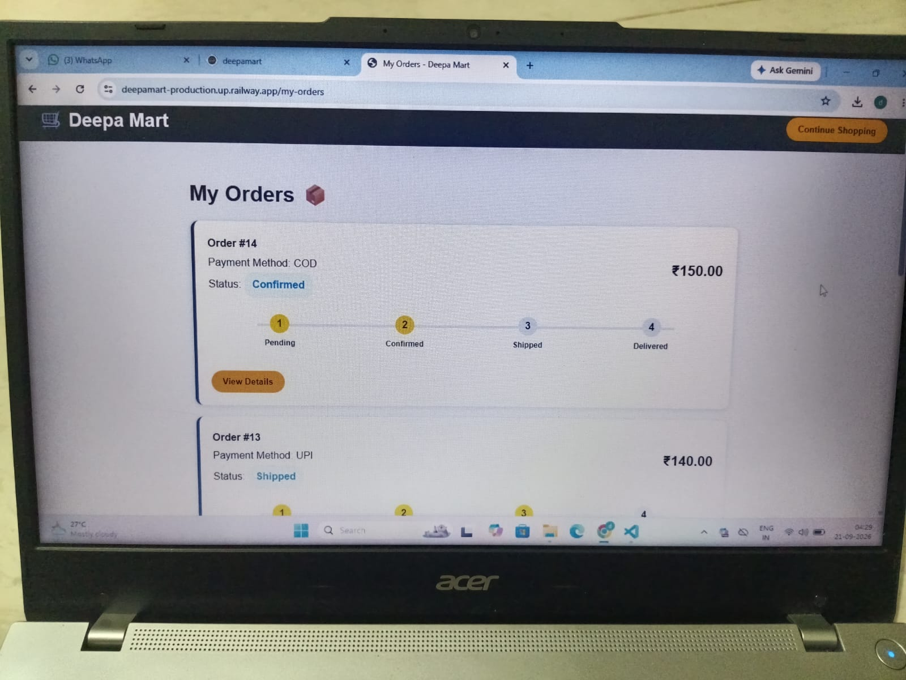

### 8. Seller Dashboard

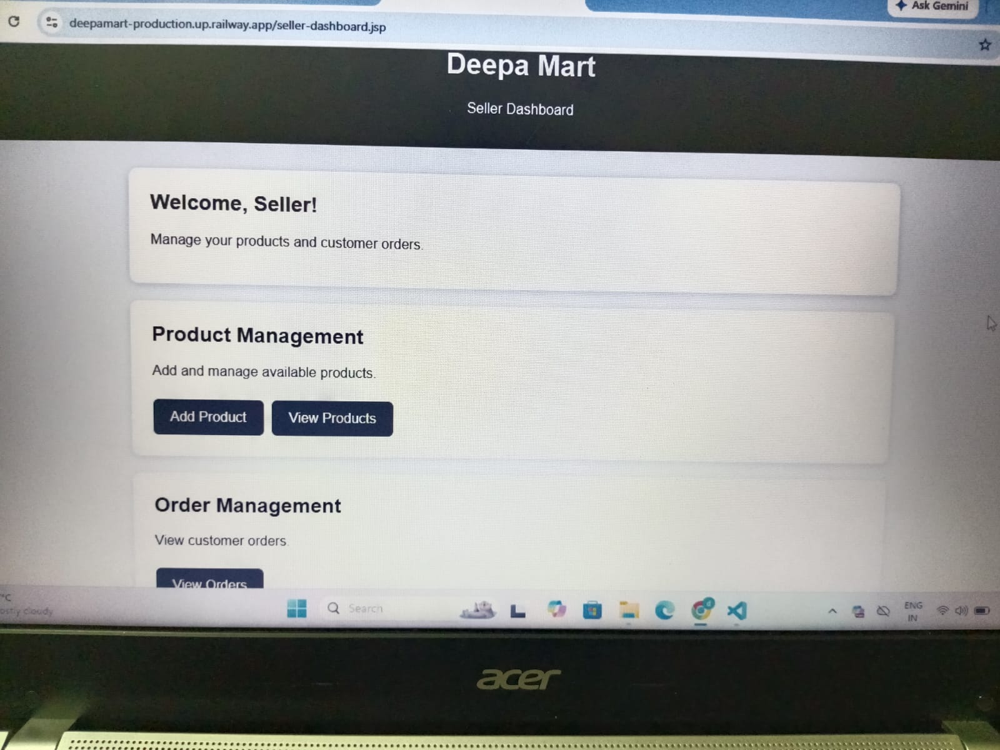

### 9. Admin Dashboard

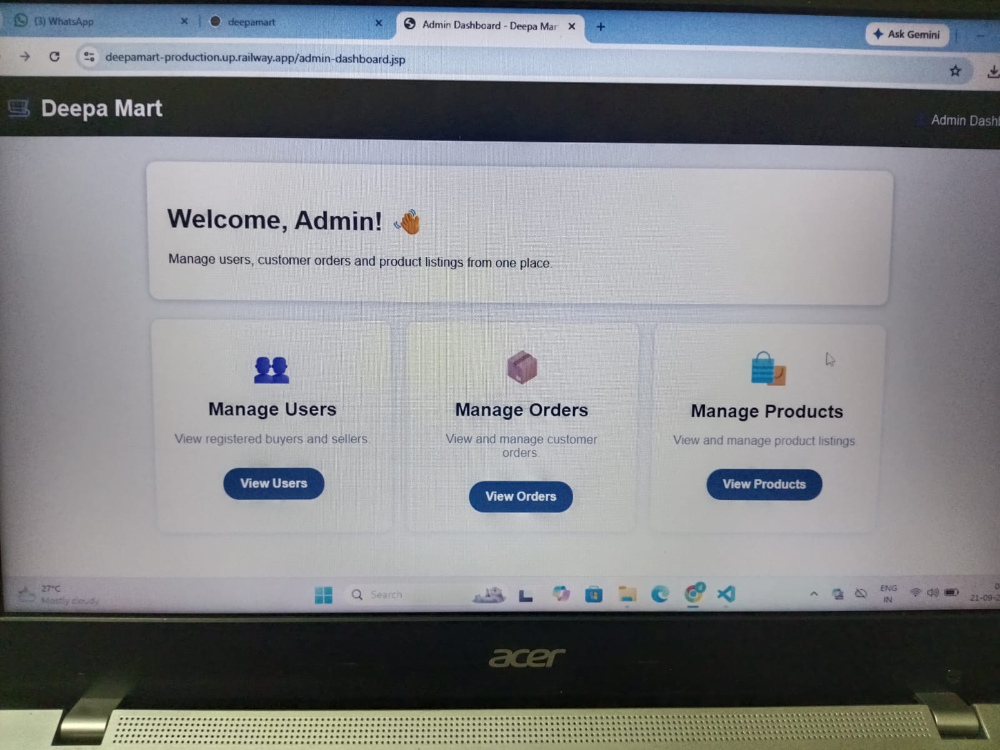

### 10. Reviews and Ratings

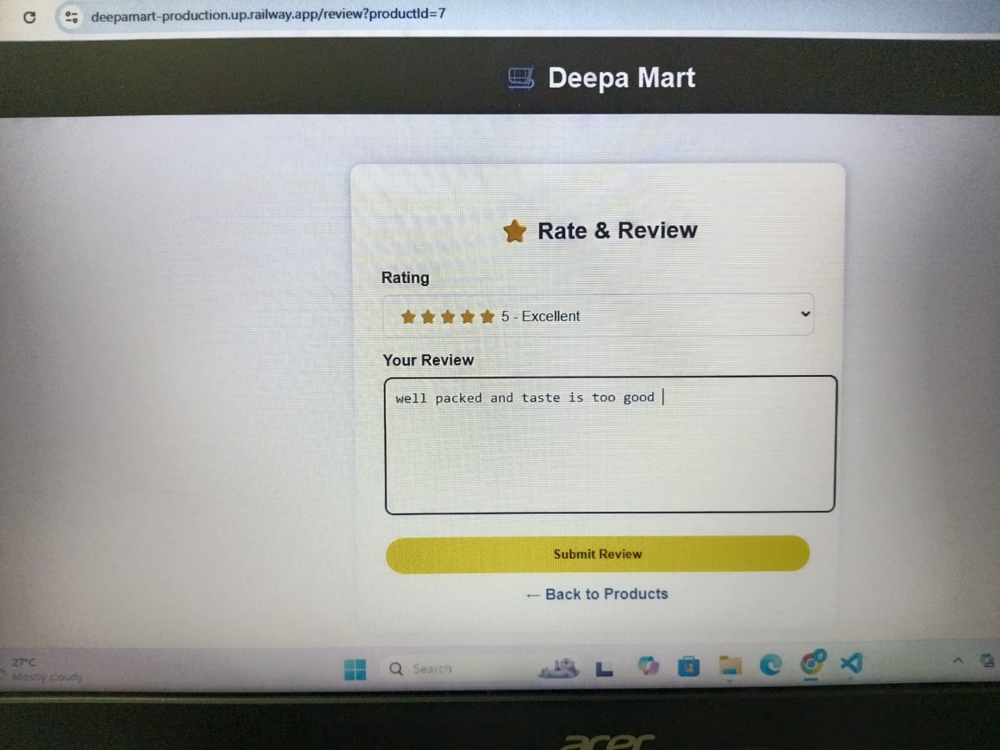

## 👥 User Roles

### 🛍️ Buyer

- Register and log in.
- Browse products.
- Add products to cart.
- Place orders.
- View order history.

### 🏪 Seller

- Log in as a seller.
- Add products.
- Edit product details.
- Delete products.
- Manage product information.

### 🛡️ Admin

- Access the admin dashboard.
- Manage application activities.
- Monitor users and products.

## 🔄 Application Workflow

```text
User Registration
        ↓
User Login
        ↓
Role Verification
        ↓
Buyer / Seller Dashboard
        ↓
Product Browsing or Product Management
        ↓
Add Product to Cart
        ↓
Checkout
        ↓
Place Order
        ↓
Order History
```
## 🧪 Testing

The following functionalities were tested during development:

- User registration and login.
- Product browsing.
- Adding products to cart.
- Checkout and order placement.
- Order history.
- Seller product management.
- Database connectivity.

## 🚀 Future Enhancements

- Implement secure password encryption.
- Add advanced product search and filtering.
- Integrate a real payment gateway.
- Improve admin management functionality.
- Add product review and rating storage.
- Add order tracking notifications.
- Improve application security.

## 👩‍💻 Developed By

**Deepa**

BE Computer Science and Engineering

J.J. College of Engineering and Technology (JJCET)

## 📄 License

This project was developed for academic and learning purposes.